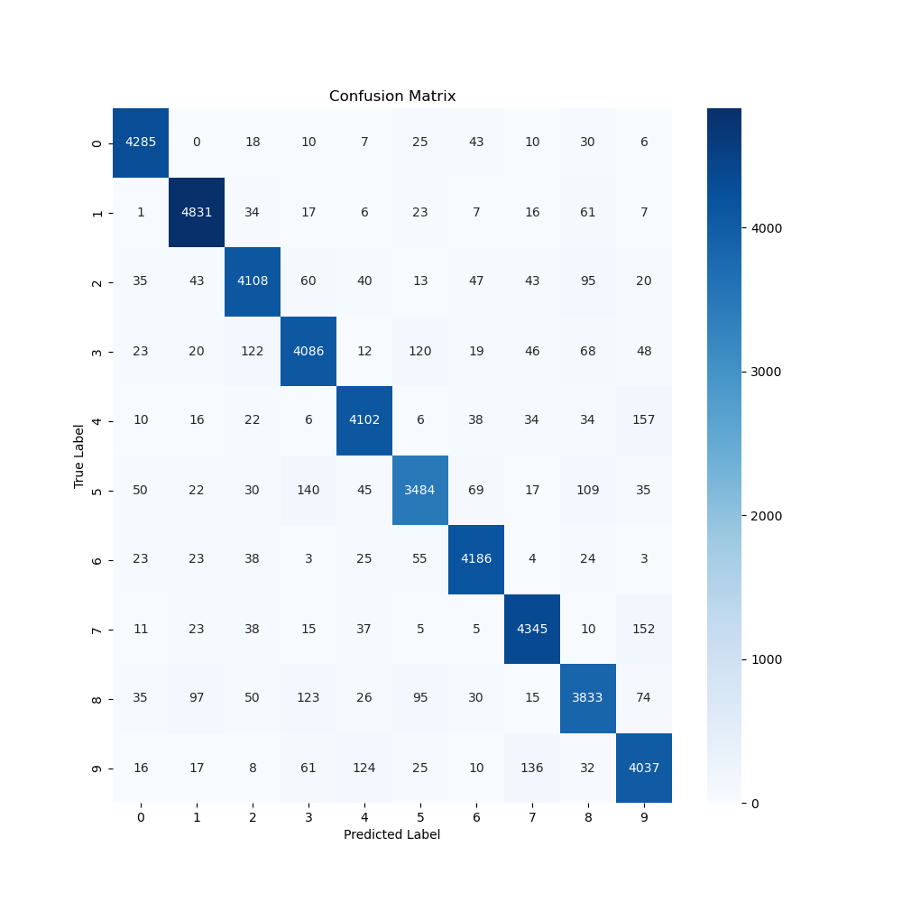

# Machine Learning Models From Scratch

This repository contains a series of machine learning models implemented from scratch in Python. It includes Naive Bayes, Logistic Regression, and Perceptron algorithms, each designed with a modular approach to facilitate understanding and further development. The repository also features comprehensive data preparation and model evaluation utilities.

## Project Files

### Scripts
- **Naive_Bayes.py**: Implements the `NaiveBayes` class for performing Naive Bayes classification, complete with methods for fitting and predicting outcomes.
- **Regression.py**: Contains the `LogisticRegression` class to handle logistic regression analysis, including model fitting and prediction capabilities.
- **Perceptron.py**: Provides the `Perceptron` class, which implements a simple Perceptron algorithm for binary classification tasks.
- **BaseModel.py**: Defines base classes such as `BaseModel` and `ClassificationModel`, which are used as foundations for other specific model classes.
- **Data_Prep.py**: Includes classes like `DataPreparation` and `MNISTData_Prep` for handling data preprocessing, ensuring data is ready for modeling.
- **HyperParams.py**: Provides the `HyperParameters` for handeling hyperparameters for each model.

- **Main.py**: Main executable script that orchestrates the workflow from data preparation to model training and evaluation.

### Utilities
- **Visualization Tools**: Integrated within various model scripts for visualizing model performance and data characteristics.


## Technologies Used

- **Python**: Primary programming language.
- **Numpy**: For numerical operations.
- **Matplotlib & Seaborn**: Used for generating visualizations.
- **Scikit-Learn**: Provides tools for model evaluation and preprocessing.
- **abc**: For creating abstract base classes.

## Setup

To run this project, follow these steps:

1. Clone this repository to your local machine.
2. Ensure Python and all required packages (`numpy`, `matplotlib`, `seaborn`, `scikit-learn`) are installed.
3. Navigate to the repository directory and run the `Main.py` script:

```bash
python Main.py
